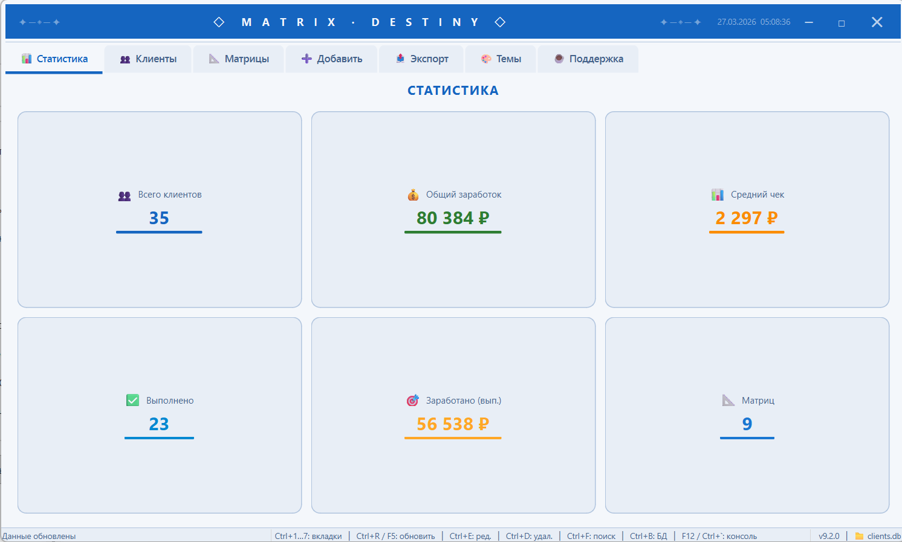

<div align="center">

# ◇ MATRIX · DESTINY ◇

### ClientManager v9.2.0

**Программа для управления клиентами и матрицами судьбы**

[](https://github.com/kscrewdze/client-management-system/releases/latest)
[](LICENSE)
[](https://python.org)
[](https://doc.qt.io/qtforpython-6/)

---

[📥 Скачать](#-как-скачать-и-установить) · [📸 Скриншоты](#-скриншоты) · [✨ Возможности](#-возможности) · [❓ FAQ](#-частые-вопросы) · [📞 Связь](#-связь)

</div>

---

## 📥 Как скачать и установить

> **Для обычных пользователей — просто скачайте и запустите!**

### Способ 1: Установщик (рекомендуется)

1. Перейдите на страницу **[Скачать последнюю версию](https://github.com/kscrewdze/client-management-system/releases/latest)**
2. Нажмите на файл **`ClientManager-v9.2.0-setup.exe`**
3. Запустите скачанный файл
4. Выберите папку для установки (или оставьте как есть)
5. Поставьте галочку **«Создать ярлык на рабочем столе»**
6. Нажмите **«Установить»** — готово! 🎉

### Способ 2: ZIP-архив (портативная версия)

1. Скачайте **`ClientManager-v9.2.0-win64.zip`** со страницы [релизов](https://github.com/kscrewdze/client-management-system/releases/latest)
2. Распакуйте архив в любую папку
3. Запустите **`ClientManager.exe`**

> 💡 База данных (`clients.db`) и экспорт сохраняются рядом с программой. При обновлении ваши данные не пропадут!

---

## 📸 Скриншоты

> Скриншоты можно посмотреть на странице [релизов](https://github.com/kscrewdze/client-management-system/releases/latest).
>
> Если хотите добавить свои — положите их в папку `screenshots/` и назовите:
> - `main.png` — главное окно
> - `themes.png` — темы оформления
> - `clients.png` — список клиентов
> - `stats.png` — статистика
> - `add.png` — добавление клиента

<!-- Раскомментируйте после добавления скриншотов:
<div align="center">
  
  <p><em>Главное окно с кастомным заголовком</em></p>
</div>
-->

---

## ✨ Возможности

### 📊 7 вкладок

| Вкладка | Что делает |
|---------|------------|
| **📊 Статистика** | Показывает сколько клиентов, общий заработок, средний чек |
| **👥 Клиенты** | Список всех клиентов с поиском и фильтрами |
| **📐 Матрицы** | Создание и управление матрицами |
| **➕ Добавить** | Быстрое добавление нового клиента |
| **📤 Экспорт** | Выгрузка всех данных в Excel |
| **🎨 Темы** | 6 красивых тем на выбор |
| **☕ Поддержка** | Поддержать проект |

### 🔍 Умный поиск

Ищет **по всем полям** — имя, телефон, Telegram, цена, дата, матрица, комментарий. Начните вводить и результаты появятся мгновенно.

### 🔢 Число Судьбы

Автоматически рассчитывается из даты рождения клиента (нумерология, числа 1–22).

### 🎨 6 тем оформления

| Тема | Стиль |
|------|-------|
| 🌿 **Изумрудная** | Спокойная, зелёные тона |
| 💎 **Сапфировая** | Деловая, синие тона |
| ❤️ **Рубиновая** | Тёплая, бордовые тона |
| 💜 **Аметистовая** | Яркая, фиолетовые тона |
| 🖤 **Тёмная** | Тёмная тема (как в VS Code) |
| 🪟 **Стеклянная** | Полупрозрачная, стильная |

Темы переключаются мгновенно — без перезапуска!

### 📤 Экспорт в Excel

Выгрузка клиентов и матриц в `.xlsx` — открываются в Excel, Google Таблицы, LibreOffice.

### ⌨️ Горячие клавиши

| Клавиша | Действие |
|---------|----------|
| `Ctrl+1`…`7` | Переключение вкладок |
| `Ctrl+R` / `F5` | Обновить данные |
| `Ctrl+E` | Редактировать клиента |
| `Ctrl+D` | Удалить клиента |
| `Ctrl+F` | Перейти к поиску |
| `Ctrl+Enter` | Сохранить клиента |
| `Ctrl+Q` | Очистить форму |
| `Ctrl+B` | Открыть браузер БД |
| `F12` / `` Ctrl+` `` | Консоль разработчика |

---

## 🛠 Для разработчиков

<details>
<summary><strong>Установка из исходников</strong></summary>

```bash
# Клонировать
git clone https://github.com/kscrewdze/client-management-system.git
cd client-management-system

# Виртуальное окружение
python -m venv venv
venv\Scripts\activate          # Windows
source venv/bin/activate       # Linux/macOS

# Зависимости
pip install -r requirements.txt

# Запуск
python main.py
```

</details>

<details>
<summary><strong>Сборка EXE</strong></summary>

```bash
pip install pyinstaller
python release_manager.py build
```

Готовый EXE в `output/dist/ClientManager/`.

</details>

<details>
<summary><strong>Сборка установщика</strong></summary>

Требуется [Inno Setup 6](https://jrsoftware.org/isdl.php):

```bash
# 1. Сначала собрать EXE
python release_manager.py build

# 2. Скомпилировать установщик
"C:\Program Files (x86)\Inno Setup 6\ISCC.exe" installer.iss
```

Результат: `output/installer/ClientManager-v9.2.0-setup.exe`

</details>

<details>
<summary><strong>Запуск тестов</strong></summary>

```bash
pip install pytest
python -m pytest tests/ -v
```

</details>

### Структура проекта

```
client_manager/
├── main.py                 # Точка входа
├── version.py              # Версия приложения
├── config/settings.py      # Настройки
├── database/               # Работа с SQLite
│   ├── core.py             # Подключение к БД
│   ├── clients.py          # CRUD клиентов
│   ├── matrices.py         # CRUD матриц
│   ├── search.py           # Поиск по всем полям
│   ├── statistics.py       # Статистика
│   └── models.py           # Модели данных
├── gui_qt/                 # Интерфейс (PySide6)
│   ├── app.py              # Запуск приложения
│   ├── main_window.py      # Главное окно
│   ├── theme.py            # Движок тем
│   ├── frames/             # Экраны (вкладки)
│   └── dialogs/            # Диалоговые окна
├── themes/themes/          # 6 цветовых схем
├── utils/                  # Валидация, даты
├── tests/                  # 114 тестов
├── installer.iss           # Inno Setup скрипт
└── release_manager.py      # Сборка релизов
```

### Зависимости

| Пакет | Версия | Назначение |
|-------|--------|------------|
| PySide6 | ≥ 6.11.0 | Интерфейс (Qt6) |
| Pillow | ≥ 12.1.0 | Изображения |
| python-dateutil | ≥ 2.9.0 | Парсинг дат |
| openpyxl | ≥ 3.1.5 | Экспорт в Excel |

---

## ❓ Частые вопросы

<details>
<summary><strong>Программа не запускается / ошибка DLL</strong></summary>

Убедитесь, что вы распаковали **все файлы** из ZIP-архива в одну папку. Не перемещайте `ClientManager.exe` отдельно от других файлов.

</details>

<details>
<summary><strong>Где хранятся мои данные?</strong></summary>

База данных `clients.db` создаётся рядом с программой. При обновлении — просто замените файлы программы, ваша база останется на месте.

</details>

<details>
<summary><strong>Как перенести данные на другой компьютер?</strong></summary>

Скопируйте файл `clients.db` из папки программы на новый компьютер в ту же папку, где установлен ClientManager.

</details>

<details>
<summary><strong>Как обновить программу?</strong></summary>

1. Скачайте новую версию со страницы [релизов](https://github.com/kscrewdze/client-management-system/releases/latest)
2. Установите поверх старой (установщик) или замените файлы в папке (ZIP)
3. Ваша база данных сохранится!

</details>

---

## 📞 Связь

- **Telegram:** [@kscrewdze](https://t.me/kscrewdze)
- **GitHub Issues:** [Сообщить о проблеме](https://github.com/kscrewdze/client-management-system/issues)
- **Предложить идею:** создайте Issue с тегом `enhancement`

---

## 📄 Лицензия

Проект распространяется под лицензией [MIT](LICENSE). Можно использовать бесплатно.

---

<div align="center">

**Сделано с ❤️ на Python + PySide6**

[](https://github.com/kscrewdze/client-management-system)

</div>
