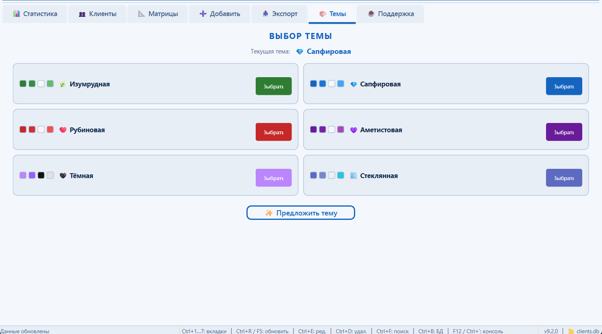

# 🏢 Client Manager v9.0

<p align="center">
  
</p>

<p align="center">
  <strong>Современное CRM-приложение для управления клиентами и матрицами</strong>
</p>

<p align="center">
  <a href="#возможности">Возможности</a> •
  <a href="#установка">Установка</a> •
  <a href="#запуск">Запуск</a> •
  <a href="#сборка-exe">Сборка EXE</a> •
  <a href="#темы">Темы</a> •
  <a href="#горячие-клавиши">Горячие клавиши</a>
</p>

---

## 📖 О проекте

Desktop CRM-приложение для управления клиентами с матричной нумерологией. Построено на **PySide6 (Qt6)** с базой данных **SQLite3**, включает 6 премиум-тем оформления, экспорт в Excel и встроенную статистику.

## ✨ Возможности

### 7 вкладок

| Вкладка | Описание |
|---------|----------|
| 📊 **Статистика** | Дашборд с 6 ключевыми метриками |
| 👥 **Клиенты** | Полный CRUD + поиск + фильтрация |
| 📐 **Матрицы** | Управление матрицами (создание, редактирование, удаление) |
| ➕ **Добавить** | Форма быстрого добавления клиента |
| 📤 **Экспорт** | Выгрузка данных в Excel (.xlsx) |
| 🗄 **База данных** | SQL-браузер с просмотром таблиц |
| 🎨 **Темы** | Переключение тем в реальном времени |

### Ключевые функции

- **Управление клиентами** — добавление, редактирование, удаление с автозаполнением полей
- **Число Судьбы** — автоматический расчёт из даты рождения (нумерология)
- **Поиск** — Unicode-совместимый поиск по имени, телефону, Telegram, комментариям
- **Экспорт в Excel** — клиенты и матрицы в формате `.xlsx`
- **6 тем оформления** — мгновенное переключение без перезагрузки
- **Статистика** — общий заработок, средний чек, количество клиентов и матриц
- **Splash Screen** — анимированный экран загрузки

## 🖥 Скриншоты

> Добавьте скриншоты приложения в папку `screenshots/` и раскомментируйте:
>
> ```
> 
> 
> ```

## 📦 Требования

- **Python** 3.10+
- **ОС**: Windows 10/11, Linux, macOS

### Зависимости

| Пакет | Версия | Назначение |
|-------|--------|------------|
| PySide6 | ≥ 6.6.0 | GUI-фреймворк (Qt6) |
| Pillow | 10.1.0 | Работа с изображениями |
| python-dateutil | 2.8.2 | Парсинг дат |
| openpyxl | 3.1.2 | Экспорт в Excel |

## 🚀 Установка

```bash
# Клонировать репозиторий
git clone https://github.com/kscrewdze/client-management-system.git
cd client-management-system

# Создать виртуальное окружение
python -m venv venv

# Активировать (Windows)
venv\Scripts\activate

# Активировать (Linux/macOS)
source venv/bin/activate

# Установить зависимости
pip install -r requirements.txt
```

## ▶️ Запуск

```bash
python main.py
```

При первом запуске автоматически создаётся база данных `clients.db` с необходимыми таблицами.

## 🔨 Сборка EXE

Для сборки standalone `.exe` файла (Windows):

```bash
pip install pyinstaller
pyinstaller ClientManager.spec
```

Готовый файл появится в `dist/ClientManager.exe`. Скопируйте `clients.db` в папку `dist/` рядом с exe-файлом.

## 🎨 Темы

Приложение поддерживает 6 тем оформления с мгновенным переключением:

| Тема | Стиль |
|------|-------|
| 🌿 Изумрудная | Профессиональная, зелёные тона |
| 💎 Сапфировая | Деловая, синие тона |
| ❤️ Рубиновая | Тёплая, бордовые тона |
| 💜 Аметистовая | Креативная, фиолетовые тона |
| 🌙 Полуночная | Тёмная тема, ночные тона |
| 🌅 Рассветная | Тёплая, оранжевые тона |

## ⌨️ Горячие клавиши

| Клавиша | Действие |
|---------|----------|
| `Ctrl+1`…`Ctrl+7` | Переключение между вкладками |
| `Ctrl+R` / `F5` | Обновить данные |
| `Ctrl+E` | Редактировать клиента |
| `Ctrl+D` | Удалить клиента |
| `Ctrl+F` | Фокус на поле поиска |
| `Ctrl+Enter` | Сохранить нового клиента |
| `Ctrl+Q` | Очистить форму |
| `F12` | Открыть отладчик (dev) |

## 🏗 Архитектура

```
client_manager/
├── main.py                 # Точка входа
├── config/settings.py      # Глобальные настройки
├── database/               # Слой данных (SQLite3)
│   ├── core.py             # Основной класс Database
│   ├── clients.py          # CRUD клиентов
│   ├── matrices.py         # CRUD матриц
│   ├── search.py           # Поиск
│   ├── statistics.py       # Статистика
│   └── models.py           # Dataclass-модели
├── gui_qt/                 # PySide6 GUI
│   ├── app.py              # QApplication + splash screen
│   ├── main_window.py      # Главное окно с вкладками
│   ├── theme.py            # QSS-движок тем
│   ├── frames/             # Фреймы вкладок
│   └── dialogs/            # Диалоговые окна
├── themes/                 # Система тем
│   └── themes/             # 6 цветовых схем
├── utils/                  # Утилиты
│   ├── date_parser.py      # Парсинг дат
│   └── validators.py       # Валидация данных
└── build_exe_hooks.py      # PyInstaller хуки
```

### Паттерны проектирования

- **Layered Architecture** — GUI → Business Logic → Database
- **Delegation** — `Database` делегирует операции в `ClientsDB`, `MatricesDB`, `SearchDB`, `StatisticsDB`
- **Dataclass Models** — `@dataclass` + `from_db_row()` + `to_dict()`
- **Manager Pattern** — `ThemeManager`, `TabsManager`, `ShortcutManager`
- **Observer/Callback** — главное окно передаёт колбэки фреймам

## 🔒 Безопасность

- Параметризованные SQL-запросы (защита от SQL-инъекций)
- Потокобезопасность через `threading.Lock`
- HTML-экранирование при экспорте (защита от XSS)
- Валидация входных данных на уровне форм

## 📄 Лицензия

Этот проект распространяется под лицензией MIT. Подробности в файле [LICENSE](LICENSE).

## 👤 Автор

**kScrewdze**

---

<p align="center">
  Сделано с ❤️ на Python + PySide6
</p>
